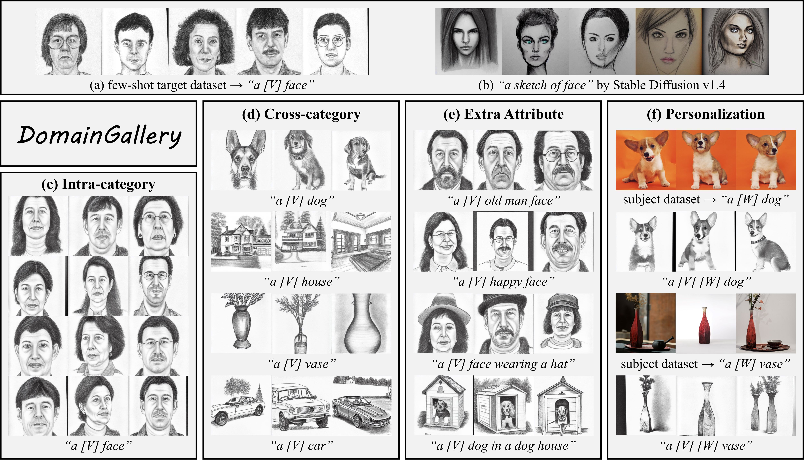
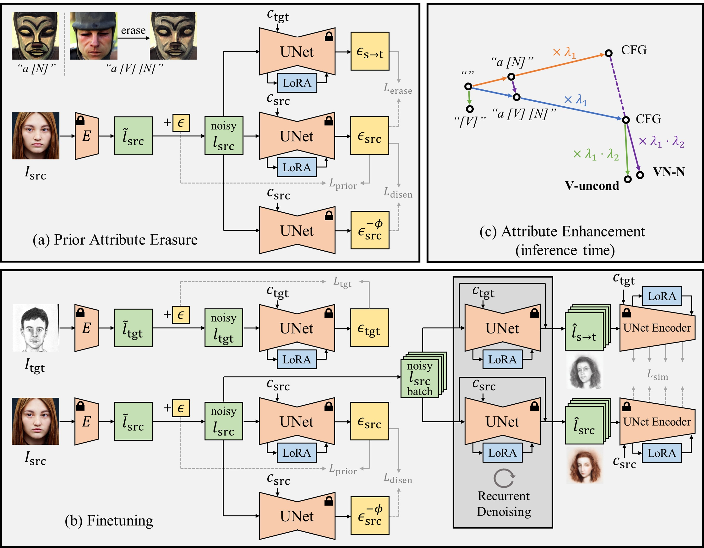

# DomainGallery



This repository is the official implementation of the following paper:

> **DomainGallery: Few-shot Domain-driven Image Generation by Attribute-centric Finetuning**<br>
> [Yuxuan Duan](https://github.com/Ldhlwh), [Yan Hong](https://github.com/hy-zpg), [Bo Zhang](https://bo-zhang-cs.github.io/), Jun Lan, Huijia Zhu, Weiqiang Wang, [Jianfu Zhang](http://www.qingyuan.sjtu.edu.cn/a/Jianfu-Zhang.html), [Li Niu](http://www.ustcnewly.com/), [Liqing Zhang](https://bcmi.sjtu.edu.cn/~zhangliqing/)<br>
> The Thirty-Eighth Annual Conference on Neural Information Processing Systems (NeurIPS 2024)<br>
> [](https://arxiv.org/abs/2411.04571)




## Getting Started

- Clone the repository:
    ```shell
    git clone https://github.com/Ldhlwh/DomainGallery.git
    cd DomainGallery
    ```
- Install python libraries:
    ```shell
    pip install -r requirements.txt
    ```


## Dataset

- We provide the few-shot target datasets (CUFS sketches, FFHQ sunglasses, Van Gogh houses, watercolor dogs, and wrecked cars) used in the paper [here](https://drive.google.com/drive/folders/1Ct3ZnSYOHEkQACMhyqbplEF-vAv_gPz7?usp=sharing). Please follow the licenses of the original datasets while using them.
- If you wish to try your own target datasets, just put them into a single folder.
    
## Stage 1: Prior attribute erasure

- Run the following script to pre-erase the prior attributes of the identifier word. This script is also at ```./script/prior_attribute_erasure.sh```.
```shell
MODEL_NAME="CompVis/stable-diffusion-v1-4"

SOURCE_NOUN="face"
IDENTIFIER="sks"

CUDA_VISIBLE_DEVICES=0 accelerate launch train_domaingallery.py --seed 0 \
  --mode "prior_attribute_erasure" --output_dir "runs/pre_erased/${IDENTIFIER}_${SOURCE_NOUN}" \
  --pretrained_model_name_or_path $MODEL_NAME  \
  --source_data_dir "source_image/${SOURCE_NOUN}" --source_prompt "a ${SOURCE_NOUN}" --target_prompt "a ${IDENTIFIER} ${SOURCE_NOUN}" --num_source_images 1000 \
  --max_train_steps 500 --train_batch_size 4 --learning_rate 1e-4  --lr_warmup_steps 0 \
  --start_checkpointing_steps 0 --checkpointing_steps 100 \
  --start_validation_steps 0 --validation_steps 100 \
  --gradient_checkpointing --use_8bit_adam \
  --offset_noise_scale 0.1 
```
- If you cannot directly access pretrained models on HuggingFace, you may either
    - download them manually and specify their path as ```MODEL_NAME```; or
    - set ```HF_ENDPOINT``` to a mirror site.
- Currently, distributed training across GPUs is not supported for either stage (prior attribute erasure or finetuning).
- You may turn off offset noise with ```--offset_noise_scale 0.0``` if your source/target images do not deviate too much from an average brightness, see [this blog](https://www.crosslabs.org/blog/diffusion-with-offset-noise) for more information.


## Stage 2: Finetuning

- Run the following script to finetune the base model on a target dataset, with LoRA modules initialized from a checkpoint in stage 1. This script is also at ```./script/train_domaingallery.sh```.
```shell
MODEL_NAME="CompVis/stable-diffusion-v1-4"

DATASET="cufs"
SOURCE_NOUN="face"
IDENTIFIER="sks"

CUDA_VISIBLE_DEVICES=0 accelerate launch train_domaingallery.py --seed 0 \
  --mode "finetuning" --output_dir "runs/${DATASET}_${IDENTIFIER}_${SOURCE_NOUN}" \
  --pretrained_model_name_or_path $MODEL_NAME --pretrained_lora_path "runs/pre_erased/${IDENTIFIER}_${SOURCE_NOUN}/checkpoint-200"  \
  --target_data_dir "target_dataset/${DATASET}" --target_prompt "a ${IDENTIFIER} ${SOURCE_NOUN}" \
  --source_data_dir "source_image/${SOURCE_NOUN}" --source_prompt "a ${SOURCE_NOUN}" --num_source_images 1000 \
  --max_train_steps 1000 --train_batch_size 4 --learning_rate 5e-5 --lr_warmup_steps 0 \
  --start_checkpointing_steps 0 --checkpointing_steps 200 \
  --start_validation_steps 0 --validation_steps 200 \
  --gradient_checkpointing --use_8bit_adam \
  --offset_noise_scale 0.1 
```

  
## Inference

- After loading the finetuned LoRA modules (see [this doc](https://huggingface.co/docs/diffusers/v0.28.2/en/using-diffusers/loading_adapters#lora)), you may generate images with the official ```StableDiffusionPipeline``` provided in diffusers if you do not intend to apply target attribute enhancement.
- If you want to use target attribute enhancement, replace the official ```StableDiffusionPipeline``` with our modified version in ```./modified_diffusers_modules/pipeline_stable_diffusion.py```, which provides an extra method:
```python
import torch
from modified_diffusers_modules.pipeline_stable_diffusion import StableDiffusionPipeline

pipe = StableDiffusionPipeline.from_pretrained("CompVis/stable-diffusion-v1-4", torch_dtype = torch.float16).to("cuda")
pipe.load_lora_weights("./runs/path/to/lora/checkpoint")

image = pipe.sample_with_dual_guidance(
  prompt = "a sks face", 
  base_prompt = "sks",  # or "a face" if using mode "VN-N" 
  target_guidance_scale = 1.0,  # lambda_2 in Eq. 6
  target_guidance_mode = "V-uncond",  # or "VN-N" 
  height = 512, width = 512, 
  ).images[0]

image.save("image.png")
```

     
## Citation

If you find DomainGallery helpful to your research, please cite our paper:
```
@inproceedings{DomainGallery,
  title     = {DomainGallery: Few-shot Domain-driven Image Generation by Attribute-centric Finetuning},
  author    = {Yuxuan Duan and Yan Hong and Bo Zhang and Jun Lan and Huijia Zhu and Weiqiang Wang and Jianfu Zhang and Li Niu and Liqing Zhang},
  booktitle = {NeurIPS},
  year      = {2024}
}
```

## Acknowledgements

- The work was supported by the National Science Foundation of China (62076162, 62471287, 62302295), and the Shanghai Municipal Science and Technology Major Project, China (2021SHZDZX0102). This work was also supported by Ant Group.
- This repository have used codes from [DreamBooth training example of diffusers](https://github.com/huggingface/diffusers/tree/main/examples/dreambooth) and [DomainStudio](https://github.com/bbzhu-jy16/DomainStudio).